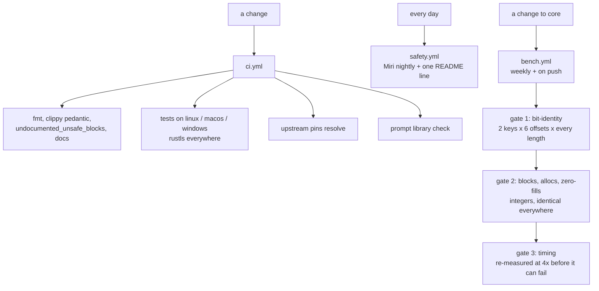

# Dovetail

A from-scratch proxy core, built to be **bit-identical to the implementations it replaces** and **verifiably not slower than any of them**.

Named for the joint that locks two members together so they carry load as one. A proxy core is a joint: clients, server and destinations under load, and a joint that lets go is worse than one that was never made.

## Status

| | |
| --- | --- |
| compiles | `cargo test --workspace` green on linux x86_64, macos aarch64 and windows x86_64 (`ci.yml`); `clippy` clean under `pedantic` (`ci.yml` lint job) |
| `record::fill_exact` | bit-identical to the `chacha20` crate at 3600 shapes per runner, on all four runners `bench.yml` measures; dense, not exhaustive — every byte 0–256 then M-1/M/M+1 per listed multiple, checked by `bench.yml` gate 1 |
| `chacha::avx2`, `chacha::sse2` | executed: gates 1 and 2 pass 3600 shapes on `linux x86_64` and `windows x86_64` |
| not slower at any length | no worse than 0.95x of the reference at any measured length from 65 bytes up; lengths 1–64 are a tie by construction and identity-checked only — gate 3 times 235 of 300 listed lengths, checked by `bench.yml` gate 3 |
| TLS backend | `rustls` implemented and compiled in `ci.yml`; handshake unproven — P6 is `doing` and no handshake test exists yet |
| upstream comparison | seven sources pinned by commit; `check-upstream-pins.sh` resolves all seven in `ci.yml`; seven checkouts present under `upstream/`, each verified at its rev with a clean worktree and listed in `upstream/manifest.toml`, re-derivable from `pins.toml` alone by `fetch-upstream.sh` and checked by nothing in CI. Four pins name a `path` that does not exist at their rev (`xray-core`, `sing-box`, `amneziawg-go`, `amnezia-client`) — see P21 |
| upstream conformance | **1 of 7** pinned suites run against a Dovetail binary, checked by `conformance.yml` run `37102681568`: all 17 of `zeronet`'s `xray_oracle` tests execute unedited against `dovetail-zeronet`, 2 pass (`vless_over_raw_tcp_matches_the_oracle` and `a_wrong_reality_public_key_is_refused_rather_than_silently_relayed`) and 15 fail by name — `trojan`, `vmess`, `shadowsocks`, `ws`, `httpupgrade`, `grpc`, `xhttp`, `XUDP`, `vlessenc` and `REALITY`/`Vision` rungs are what is missing; the other six pins have no injection seam at their rev — [`conformance.md`](docs/conformance.md) |
| memory safety | Miri nightly on the safe-Rust core: PASS 2026-10-03 — next check 2026-10-04 03:11 UTC (SIMD cores: differential test, not Miri) |
| first green CI run | green 2026-10-02, all six jobs, checked by `ci.yml` run 37077244861 |
| claim audit | every claim in this table and in `docs/`, with its checker and its verdict: [`docs/claims.md`](docs/claims.md) | audited by hand 2026-10-03 against the runs it quotes; **nothing runs the audit**, which is the one line in this table with no checker |

Every row above names the run or job that produced it; per-architecture rows come from jobs whose names state the architecture. The un-narrowed "not slower at any single length" is claimed nowhere: the claim is the narrowed one in the table, which is what gate 3 checks.

## What is claimed

| claim | checked by |
| --- | --- |
| byte-identical output, every length, every device | differential test against the pinned reference, run before any timing |
| no worse than 0.95x of the reference at any measured length from 65 bytes up; lengths 1–64 are a tie by construction and identity-checked only | benchmark gate over the timed sweep; one regressing length fails the job, after a re-measure |
| no use-after-free, no leak | Miri nightly for the safe-Rust paths, daily via `safety.yml`; differential tests for the rest |
| no work generated and discarded | the ladder returns the blocks it generated; gate 2 compares that against `ceil(len / 64)` at every length and block offset |
| no heap allocation, no zero-fill | counting global allocator, gated at exactly 0 |

Not claimed: that this is the fastest implementation. A benchmark measures a configuration at a point in time and then decays — a new CPU, a new upstream release, a changed input distribution. What is built instead is the machinery that notices, so `bench.yml` runs weekly on one native runner per ISA and fails on any regressing length. See [`docs/methodology.md`](docs/methodology.md).

## How it is built

Nothing is ever compiled on a developer machine. Every build, test, benchmark and comparison happens in CI on a runner whose architecture is named in the job, because a number produced locally describes the machine that produced it and is evidence about no other.



Four design decisions explain most of the tree.

**One algorithm, four widths.** The record layer is a single generic function over a `Lanes` trait, instantiated for portable arrays, NEON, SSE2 and AVX2, so the backends execute the *same source* and cannot disagree about the algorithm. Only the primitives each backend means are tested. Because the portable backend is safe Rust, Miri interprets the ladder, the counter arithmetic and every store offset through it, leaving the SIMD modules five instructions each whose only failure mode is a wrong answer.

| backend | blocks per iteration | registers | Miri |
| --- | --- | --- | --- |
| portable `[u32; 4]` | 4 | 16 arrays | yes, in full |
| NEON `uint32x4_t` | 4 | 16 `q` | no — differential test |
| SSE2 `__m128i` | 1 (the one-block tail) | 4 `xmm` | yes, in full — interpreted, not yet run |
| AVX2 `__m256i` | 8 (two states per register) | 16 `ymm` | no — differential test |

Rewrite, not port: the minimal subset covering the matrix — a superset of connection ways, a subset of code — proven faster down to the parsing. Fixes leave no trace: one line of comment per item at most, no changelogs. The full philosophy is the shared protocol in [`prompts.md`](crates/dovetail-prompt/prompts.md); the comment rule is checked by `scripts/check-comments.sh`.

**The reference is not as fast as it looks.** `chacha` 0.9.1 only selects NEON behind a cfg nothing sets, so on aarch64 it runs a scalar one-block core while on x86_64 it runs four-block AVX2. Much of any aarch64 speedup is the reference not using its SIMD path, not this repository's work — so every report prints both backends in the header. A ratio quoted without both names is not a measurement.

**One TLS stack, one interface.** `TlsProvider` is implemented by the rustls backend, and the provider *is* `Read + Write`, so nothing above can depend on the stack underneath. There is no feature to select and no build without TLS, because a caller who finds no provider reaches for plaintext.

**Quiche is the default QUIC, not a preference.** When a rung needs QUIC — `superset.md` rows 8 and 9 — the stack is **quiche**, whenever it is available and whenever implementing that rung on it is feasible. A rung may choose something else only where an alternative has a faster or safer implementation *for that specific thing*, and the diff says which rung, which library, and the measurement or the proof that made it win; "quinn was easier to write" is not a reason, and neither is familiarity. The default is not sacred and it is not a coin toss either: quiche is preferred because it already ships and runs at scale what most of those rows need (HTTP/3, 0-RTT, connection migration, key updates, batched datagram I/O), so the rung inherits that instead of rebuilding it — and a row that needs a capability Quiche lacks takes the library that has it and justifies the departure in the same push, where the benchmark gate is already running.

Details: [`chacha-xor-blocks.md`](docs/function/chacha-xor-blocks.md), [`unsafe-policy.md`](docs/unsafe-policy.md), [`tls-provider.md`](docs/function/tls-provider.md).

## Goals

**1 — prove everything shipped is faster and leaner.** Bit-identical output, fewer operations, zero surviving copies: the math in [`unsafe-policy.md`](docs/unsafe-policy.md), the method in [`methodology.md`](docs/methodology.md).

**2 — become a drop-in replacement.** `dovetail-core` is a *superset* of Xray-core, sing-box, xray-rust and PattNG's Xray fork — every way PattNG can connect parses, one method dials at a time ([`superset.md`](docs/arch/superset.md)). Upstream suites are meant to run against Dovetail binaries in CI, never copied here (licence-clean) — and **one does**: 1 of 7, `zeronet`'s `xray_oracle` differential against `dovetail-zeronet`, all 17 tests unedited, 2 passing and 15 failing by name, checked by `conformance.yml`. The other six pins have no injection seam at their rev ([`conformance.md`](docs/conformance.md)).

```bash
cargo run -p dovetail-bench -- --config 'vless://...'   # the comparison table for a link
cargo run -p dovetail-zeronet -- check 'vless://...'     # parse offline; `run` dials TCP, sends nothing
```

Offline by default; a live comparison needs `live=true` in `compare.yml`. Credentials never reach a report.

## Scope

A drop-in for Xray-core, sing-box, Amnezia and the Rust ports of each is not one program — it is five surfaces with different wire formats, config schemas and APIs. This repository builds the primitives they share and proves each one before adding a surface, because a surface built on an unproven primitive inherits its bugs and its silence.

## Layout

```
crates/dovetail-core      record layer, ChaCha20 core, TLS interface + its rustls backend,
                          vless parser, transport superset, proof policy
crates/dovetail-bench     counting allocator, three gates, benchmark report, comparator
crates/dovetail-zeronet   ZeroNet-compatible app on dovetail-core (MIT)
crates/dovetail-prompt    roadmap advisor; reads prompts.md, the only place a slice
                          is written down
docs/arch                 architecture + superset matrix, with diagrams
docs/function             one page per function, with diagrams
upstream/                 pins plus derived reading copies: `upstream/<name>/`
                          checkouts are re-fetched from the pins by
                          `scripts/fetch-upstream.sh` and never committed
scripts/                  pin checking, upstream fetching, comment-trace checking
```

## Driving this with an agent

The roadmap is a file, [`prompts.md`](crates/dovetail-prompt/prompts.md), and every slice in it carries a status, a leverage, an effort, the gates that would prove it finished, and the slices it blocks. "What should I work on" is a computed answer rather than whoever had the most recent idea.

```bash
cargo run -p dovetail-prompt -- next        # the slice, the reason, prompt → clipboard
cargo run -p dovetail-prompt -- list        # the roadmap, with what is ready now
cargo run -p dovetail-prompt -- check       # is the library still coherent?
```

`next` prints its reasoning above the prompt: highest leverage whose dependencies are done, ties broken towards the smaller slice, what it unblocks, and the gates that must be green before it counts as done. It refuses to hand over a slice whose required inputs are unfilled, printing the exact `--set` command instead — an agent given a prompt with a hole in it will fill the hole with something plausible.

Pinned checkouts under `upstream/` are for reading only: an agent starts every rung in the corresponding upstream implementation and ends in CI. A number produced off a named runner is not evidence about any runner.

The loop:

```bash
cargo run -p dovetail-prompt -- next --rotate   # a different slice than last time
# ... hand the prompt to an agent, push the branch, read CI ...
# then record what happened: edit **Status:** in prompts.md
cargo run -p dovetail-prompt -- check           # optional — see below
```

`check` is a CI step, so it is not required of an agent and should be skipped when it is not available: it needs a `cargo build` that succeeds. If you cannot build, skip it — CI runs the same command and will say so. If you can, run it: it is the only thing that catches a `**Touches:**` path you renamed without meaning to.

Three properties make this unattended rather than advisory, and each is enforced:

- **The library cannot silently rot.** `check` runs in `ci.yml` and fails on a duplicate id, a slice with no gate, a dependency on a prompt that does not exist, a cycle, or a `**Touches:**` path that has been renamed — so an agent that moves or deletes something is told in the same push.
- **Progress is recorded once.** Status is the only field to edit, and a slice is `done` when its gates are green, not when its diff looks finished. Every handout is logged to `.dovetail/slices.log`, so `--rotate` does not repeat itself.
- **Nothing is handed over half-finished.** A slice that exposes a larger problem becomes a new slice in `prompts.md` with the same fields every other slice has, so the next agent inherits a plan rather than a suspicion.

Adding a slice is a section of Markdown — no schema, nothing to recompile. The fields are what make a slice answerable: `**When to use:**` stops an agent picking the wrong one, `**Gates:**` stops it calling something done on a local run, and `**Depends on:**` stops it starting something whose predecessor never landed. See [`prompt-next-slice.md`](docs/function/prompt-next-slice.md).

## Contributing

Start here, in this order:

```bash
./scripts/new-worktree.sh <name>   # isolated worktree: shared build cache, linked upstreams
./scripts/fetch-upstream.sh        # only what the links missed (ZeroNet: fork first, official fallback)
cargo run -p dovetail-prompt -- next  # the slice, then author locally, push, read CI
```

Worktree first, so branches never share a working tree. The fetch is step zero before the prompt tool: every rung starts in the corresponding upstream implementation, and `upstream/` checkouts are re-derived — never committed, never trusted past their pins. Re-run the fetch whenever `upstream/pins.toml` changes under you.

Upstream suites are executed, never copied. Add a conformance check to the CI harness rather than vendoring tests here: sing-box is GPL-3.0 and Xray-core is MPL-2.0, so a copied test would make this work's licence undecidable.

## Licence

`MIT OR Apache-2.0` — see [`LICENSE-MIT`](LICENSE-MIT) and [`LICENSE-APACHE`](LICENSE-APACHE). Every dependency permits both, and Apache-2.0 contributes the express patent grant that a cryptographic core should carry.
