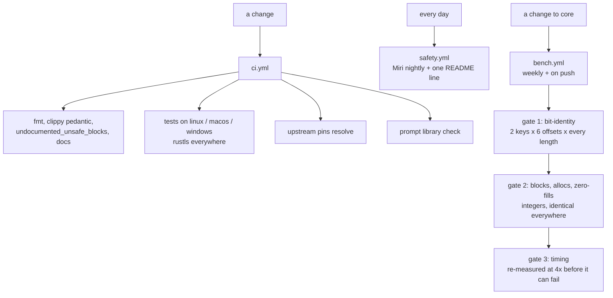

# Dovetail

A from-scratch proxy core, built to be **bit-identical to the implementations it replaces** and **verifiably not slower than any of them**.

Named for the joint that locks two members together so they carry load as one. A proxy core is a joint: clients, server and destinations under load, and a joint that lets go is worse than one that was never made.

## Status

| | |
| --- | --- |
| compiles | `cargo test --workspace` green on linux x86_64, macos aarch64 and windows x86_64 (`ci.yml`); `clippy` clean under `pedantic` (`ci.yml` lint job) |
| `record::fill_exact` | bit-identical to the `chacha20` crate at 3600 shapes per runner, on all four runners `bench.yml` measures; dense, not exhaustive — every byte 0–256 then M-1/M/M+1 per listed multiple, checked by `bench.yml` gate 1 |
| `chacha::avx2`, `chacha::sse2` | executed: gates 1 and 2 pass 3600 shapes on `linux x86_64` and `windows x86_64` |
| not slower at any length | no worse than 0.95x of the reference at any measured length from 65 bytes up; lengths 1–64 are a tie by construction and identity-checked only — gate 3 times 235 of 300 listed lengths, checked by `bench.yml` gate 3 |
| TLS backend | `rustls` implemented and compiled in `ci.yml`; the handshake is proved by `tls::rustls_backend::tests::handshake_connects_and_echoes`, `…::mismatched_certificate_name_fails` and `…::refused_alpn_fails`, run by `cargo test --workspace` in `ci.yml` |
| upstream comparison | twelve sources pinned by commit; `check-upstream-pins.sh` resolves all twelve in `ci.yml`; twelve checkouts present under `upstream/`, each verified at its rev with a clean worktree and listed in `upstream/manifest.toml`, re-derivable from `pins.toml` alone by `fetch-upstream.sh` and checked by nothing in CI. Four pins name a `path` that does not exist at their rev (`xray-core`, `sing-box`, `amneziawg-go`, `amnezia-client`) — see P12 |
| upstream conformance | **2 of 12** pinned suites run against `dovetail-zeronet`, checked by `conformance.yml`: `zeronet` 7 of 17 `xray_oracle` (raw-`TCP` `VLESS`, `trojan`, `shadowsocks`, `vmess` plus `VLESS` over `ws`/`httpupgrade`/`grpc`) and `xray-rust` 5 of 23 `local_xray_interop_tests` (plain-`TCP` trio plus `ws` and `httpupgrade`); the other ten pins have no seam — [`conformance.md`](docs/conformance.md) |
| memory safety | Miri nightly on the safe-Rust core: PASS 2026-10-03 — next check 2026-10-04 03:11 UTC (SIMD cores: differential test, not Miri) |
| first green CI run | green 2026-10-02, all six jobs, checked by `ci.yml` run 37077244861 |
| claim audit | every claim in this table and in `docs/`, with its checker and its verdict: [`docs/claims.md`](docs/claims.md) | audited by hand 2026-10-03 against the runs it quotes; **nothing runs the audit**, which is the one line in this table with no checker |

Every row above names the run or job that produced it; per-architecture rows come from jobs whose names state the architecture. The un-narrowed "not slower at any single length" is claimed nowhere: the claim is the narrowed one in the table, which is what gate 3 checks.

## What is claimed

| claim | checked by |
| --- | --- |
| byte-identical output, every length, every device | differential test against the pinned reference, run before any timing |
| no worse than 0.95x of the reference at any measured length from 65 bytes up; lengths 1–64 are a tie by construction and identity-checked only | benchmark gate over the timed sweep; one regressing length fails the job, after a re-measure |
| no use-after-free, no leak | Miri nightly for the safe-Rust paths, daily via `safety.yml`; differential tests for the rest |
| no work generated and discarded | the ladder returns the blocks it generated; gate 2 compares that against `ceil(len / 64)` at every length and block offset |
| no heap allocation, no zero-fill | counting global allocator, gated at exactly 0 |

Not claimed: that this is the fastest implementation. A benchmark measures a configuration at a point in time and then decays — a new CPU, a new upstream release, a changed input distribution. What is built instead is the machinery that notices, so `bench.yml` runs weekly on one native runner per ISA and fails on any regressing length. See [`docs/methodology.md`](docs/methodology.md).

## How it is built

Nothing is ever compiled on a developer machine. Every build, test, benchmark and comparison happens in CI on a runner whose architecture is named in the job, because a number produced locally describes the machine that produced it and is evidence about no other.



Four design decisions explain most of the tree.

**One algorithm, four widths.** The record layer is a single generic function over a `Lanes` trait, instantiated for portable arrays, NEON, SSE2 and AVX2, so the backends execute the *same source* and cannot disagree about the algorithm. Only the primitives each backend means are tested. Because the portable backend is safe Rust, Miri interprets the ladder, the counter arithmetic and every store offset through it, leaving the SIMD modules five instructions each whose only failure mode is a wrong answer.

| backend | blocks per iteration | registers | Miri |
| --- | --- | --- | --- |
| portable `[u32; 4]` | 4 | 16 arrays | yes, in full |
| NEON `uint32x4_t` | 8 | 32 `q` | no — differential test |
| SSE2 `__m128i` | 1 (the one-block tail) | 4 `xmm` | yes, in full — interpreted, not yet run |
| AVX2 `__m256i` | 8 (two states per register) | 16 `ymm` | no — differential test |

Rewrite, not port: the minimal subset covering the matrix — a superset of connection ways, a subset of code — proven faster down to the parsing. Fixes leave no trace: one line of comment per item at most, no changelogs. The full philosophy is the shared protocol in [`prompts.md`](crates/dovetail-prompt/prompts.md); the comment rule is checked by `scripts/check-comments.sh`.

**The reference is not as fast as it looks.** `chacha` 0.9.1 only selects NEON behind a cfg nothing sets, so on aarch64 it runs a scalar one-block core while on x86_64 it runs four-block AVX2. Much of any aarch64 speedup is the reference not using its SIMD path, not this repository's work — so every report prints both backends in the header. A ratio quoted without both names is not a measurement.

**One TLS stack, one interface.** `TlsProvider` is implemented by the rustls backend, and the provider *is* `Read + Write`, so nothing above can depend on the stack underneath. There is no feature to select and no build without TLS, because a caller who finds no provider reaches for plaintext.

**Quiche is the default QUIC, not a preference.** When a rung needs QUIC — `superset.md` rows 8 and 9 — the stack is **quiche**, whenever it is available and whenever implementing that rung on it is feasible. A rung may choose something else only where an alternative has a faster or safer implementation *for that specific thing*, and the diff says which rung, which library, and the measurement or the proof that made it win; "quinn was easier to write" is not a reason, and neither is familiarity. The default is not sacred and it is not a coin toss either: quiche is preferred because it already ships and runs at scale what most of those rows need (HTTP/3, 0-RTT, connection migration, key updates, batched datagram I/O), so the rung inherits that instead of rebuilding it — and a row that needs a capability Quiche lacks takes the library that has it and justifies the departure in the same push, where the benchmark gate is already running.

Details: [`chacha-xor-blocks.md`](docs/function/chacha-xor-blocks.md), [`unsafe-policy.md`](docs/unsafe-policy.md), [`tls-provider.md`](docs/function/tls-provider.md).

## Goals

**1 — prove everything shipped is faster and leaner.** Bit-identical output, fewer operations, zero surviving copies: the math in [`unsafe-policy.md`](docs/unsafe-policy.md), the method in [`methodology.md`](docs/methodology.md).

**2 — become a drop-in replacement.** `dovetail-core` is a *superset* of Xray-core, sing-box, xray-rust, PattNG's Xray fork, ZeroNet/Zray, mqvpn, Aether, zeptun, slipstream and quiche — every way PattNG can connect parses, one method dials at a time ([`superset.md`](docs/arch/superset.md), full matrix below). Upstream suites are meant to run against Dovetail binaries in CI, never copied here (licence-clean) — and **two do**: 2 of 12, `zeronet` 7 of 17 and `xray-rust` 5 of 23 against `dovetail-zeronet`, checked by `conformance.yml`. The other ten pins have no seam ([`conformance.md`](docs/conformance.md)).

**3 — spoof SNI without root.** DPI circumvention by injecting a fake TLS ClientHello carrying an allowlisted SNI ahead of the real handshake; needs no `CAP_NET_RAW`, no `SOCK_RAW`, no root on Android — `VpnService` TUN plus a userspace TCP stack does it all in user space — which nothing in CI checks yet.

```bash
cargo run -p dovetail-bench -- --config 'vless://...'   # the comparison table for a link
cargo run -p dovetail-zeronet -- check 'vless://...'     # parse offline; `run` dials TCP, sends nothing
```

Offline by default; a live comparison needs `live=true` in `compare.yml`. Credentials never reach a report.

## Connection methods: every way, who supports it

Dovetail is a subset of code and a superset of connection ways: every row below
parses, exactly one dials today, and a row moves to dials only with its
differential proof and its benchmark gate. The `Dovetail` column is read from
`vless::support()` / `transport.rs` where a `vless://` link can express the row;
the rest mirror `transport.rs` until their rung lands. `Supported today by`
means the pinned rev contains that transport (a `proxy/` entry, a `protocol/`
entry, a CLI flag, or a config section) — not that CI runs it. Upstream suites
are never copied here (licence-clean): sing-box is GPL-3.0, Xray-core/xray-rust
are MPL-2.0, PattNG is GPL-3.0, Aether is AGPL-3.0, mqvpn/slipstream are
Apache-2.0, quiche is BSD-2.0, zeptun/ZeroNet are MIT. They run unmodified from
their pins.

Twelve pins, all resolving, all re-derivable by `scripts/fetch-upstream.sh`:
`xray-core` (`b26a91de`), `sing-box` (`c9922979`), `amneziawg-go` (`b5928efb`),
`amnezia-client` (`94b51df2`), `xray-rust` (`7a4fb2dd`, `crates/`),
`pattng` (`ad6f747c`, `V2rayNG/`), `zeronet` (`97a99734`, `crates/`),
`mqvpn` (`b11a2f69`, `src/`), `aether` (`21e7150a`, `aether/`),
`zeptun` (`5620e57c`, `src/`), `slipstream` (`397850b1`, `src/`),
`quiche` (`3fc9bc1c`, `quiche/`, `master`).
Aether is open source (`CluvexStudio/Aether`): it is pinned directly here, not
only vendored as the `libaether.so` constant PattNG names. Quiche is pinned
because it is the default QUIC for the MASQUE/H3 rungs, not a preference.

Read but not pinned (learnings only, never vendored): `WhiteDNS/CottenDNS`,
`masterking32/MasterDnsVPN`, `mlmvpn/mlmvpn_android`, and the local `configer`
project (`foxy` + `https-proxy` lanes, `connectionMethods`, `tor/profile.dart`).
Their ways below are rows to implement, not checkouts to track.

### A — proxy protocols (the share-link world)

| # | method | Dovetail | supported today by |
| --- | --- | --- | --- |
| 1 | VLESS TCP REALITY `xtls-rprx-vision` | implemented (`vless-tcp-reality-vision`) | Xray-core (`proxy/vless` + `transport/internet/reality`), sing-box (`protocol/vless`), xray-rust (VLESS client over TCP), PattNG (`VLESS`), ZeroNet/Zray |
| 2 | VLESS TCP TLS (Vision optional) | planned | Xray-core, sing-box, xray-rust (TLS + REALITY), PattNG, ZeroNet |
| 3 | VLESS TCP none, private/loopback only | planned | Xray-core, sing-box, xray-rust (documented TCP subset), PattNG, ZeroNet |
| 4 | VLESS/TROJAN `security=none` to public (PattNG ext., plaintext) | unsafe opt-in (`allow_plaintext_to_public`) | PattNG only — upstream Xray-core refuses it |
| 5 | TROJAN TCP TLS | implemented (`trojan-tcp`, raw `TCP` only, no `UDP`) (conformance 37132662374) | Xray-core (`proxy/trojan`), sing-box (`protocol/trojan`), PattNG (`TROJAN`), ZeroNet |
| 6 | VMess TCP (AEAD) | implemented (`vmess-tcp-aead`) | Xray-core (`proxy/vmess`), sing-box (`protocol/vmess`), PattNG (`VMESS`), ZeroNet — xray-rust explicitly has none |
| 7 | Shadowsocks TCP/UDP (+2022) | implemented (`shadowsocks-tcp-aes-256-gcm`, no `2022`, no `UDP`) (conformance 37132662374) | Xray-core (`proxy/shadowsocks`, `shadowsocks_2022`), sing-box (`protocol/shadowsocks`), PattNG (`SHADOWSOCKS`), ZeroNet |
| 8 | VLESS over WS / XHTTP / gRPC / QUIC / HTTPUpgrade / KCP | planned, one rung each, never batched | Xray-core (`transport/internet/{ws,grpc,quic,kcp,httpupgrade}` + `transport/v2ray*`), sing-box (`transport/v2ray*`), PattNG, ZeroNet — xray-rust TCP only |
| 9 | Hysteria / Hysteria2, TUIC, AnyTLS, ShadowTLS, Snell, Naive, SSH, OpenConnect/OpenVPN | planned | sing-box (`protocol/{hysteria,hysteria2,tuic,anytls,shadowtls,snell,naive,ssh}`), Xray-core (`proxy/hysteria` + `transport/internet/hysteria`), PattNG (`HYSTERIA`, `HYSTERIA2`) |
| 10 | `cipherSuites` + `unsafe-*` fingerprints (PattNG ext.) | unsafe opt-in (`allow_unsafe_fingerprint`) | PattNG only — parsed and carried here, never default |

### B — PattNG in full (what the fork actually wires)

PattNG `EConfigType`: `VMESS`, `SHADOWSOCKS`, `SOCKS`, `VLESS`, `TROJAN`,
`WIREGUARD`, `HYSTERIA2`, `HYSTERIA`, `HTTP`, fork-only `AETHER` (500),
`POLICYGROUP` (101), `PROXYCHAIN` (102).

| # | method | Dovetail | supported today by |
| --- | --- | --- | --- |
| 11 | `PROXYCHAIN` ordered member list (reorderable UI, per-member types) | planned (see chaining below) | PattNG only (`ServerProxyChainActivity`, `ProxyChainMembers`) — constraint: at most one `AETHER` member per chain, one core runs at a time |
| 12 | `POLICYGROUP` / routing groups | planned | PattNG only |
| 13 | Psiphon client run as its own program (`AETHER_PSIPHON_BIN`, staged as `libpsiphon-tunnel-core.so`) | planned | PattNG (`compile-psiphon.sh` + Aether `psiphon.rs`) and mlmvpn (standalone Psiphon engine) |
| 14 | Pluggable transports via lyrebird (`obfs4` / `snowflake` / `webtunnel` / `meek`, `AETHER_TOR_PT`, staged as `liblyrebird.so`) | planned | PattNG (`compile-pt.sh` + Aether `pt/`) and Aether (bridgedb + PT folder beside the binary) |
| 15 | hev-socks5-tunnel TUN (`libhev-socks5-tunnel.so` via `TProxyService`, VpnService hev tun mode) | planned | PattNG (`compile-hevtun.sh`, `hev-socks5-tunnel` submodule from `heiher/hev-socks5-tunnel`) |

### C — VPN / tunnel carriers

| # | method | Dovetail | supported today by |
| --- | --- | --- | --- |
| 16 | WireGuard (UDP) | planned (rung 9) | Xray-core (`proxy/wireguard`), sing-box (`protocol/wireguard`), Aether (`--wg`), PattNG (`WIREGUARD`), ZeroNet WARP paths, mlmvpn (`AmneziaWgInjector`, `kittoku` WG) |
| 17 | AmneziaWG (WireGuard with obfuscation) | planned | amneziawg-go (`device/`, `tun/`), amnezia-client, mlmvpn |
| 18 | MASQUE CONNECT-IP over QUIC, RFC 9484 | planned (rung 9, quiche by default) | mqvpn (`src/`, CONNECT-IP over MP-QUIC), Aether (`--masque`, HTTP/3 or HTTP/2), sing-box (`protocol/masque`), Xray-core (`proxy/masque` + `transport/internet/masque`), PattNG, configer `masque` lane (Fastly edge) |
| 19 | MASQUE over HTTP/3 vs HTTP/2 carriers | planned | Aether (H3 default, `--h2` moves the same tunnel to TCP 443), mqvpn (HTTP/3 + datagrams), configer (native QUIC + H2 fallback) |
| 20 | Multipath QUIC, draft-ietf-quic-multipath | planned | mqvpn (MP-QUIC + WLB family), slipstream (picoquic MP, multi-resolver parallel), quiche (the pinned stack) |
| 21 | quiche itself: QUIC + HTTP/3, 0-RTT, migration, key updates, batched datagram I/O | planned (provider, not a lane) | quiche pin (`quiche/`, Cloudflare) — every QUIC rung dials through it unless the diff proves another stack wins for that rung |
| 22 | Multipath schedulers `minrtt` / `wlb` / `wlb_udp_pin` / `backup_fec` | planned | mqvpn only (`mqvpn_sched_names.h`, `vpn_client.h`) |
| 23 | Hybrid TCP lane (local TCP termination over an H3 request stream) | planned | mqvpn only (`[Hybrid]` classifier) |
| 24 | Reorder buffer (datagram lane) + reinjection (`deadline` / `idle` / `dgram`) | planned | mqvpn only (`[Reorder]`, `Reinjection`) |
| 25 | Nested WireGuard (`gool`, two hops) | planned | Aether only (`--gool`, `--wiw-outer` / `--wiw-inner` / `--wiw-peers`) |
| 26 | Nested MASQUE (`mim`, tunnel inside a tunnel) | planned | Aether only (`--mim`, `--mim-outer` / `--mim-inner`) |
| 27 | TCP-over-DNS covert channel (base32 domain + TXT, QUIC reliability) | planned | slipstream only (`src/slipstream_{client,server}*`, `docs/protocol.md`) |
| 28 | Multi-resolver parallel + direct port-53 impersonation, DCUBIC/BBR | planned | slipstream only (`docs/usage.md`: `--resolver-address`, `--domain`, `--congestion-control`) |
| 29 | tun2socks engine (TUN to TCP/UDP/ICMP via SOCKS5 / direct / passthrough; `userspace` / `hybrid` / `system` stacks) | planned | zeptun only (`src/config.zig` `HandlerKind`, `src/stack/`) |

### D — DNS-tunnel ways (learned from CottenDNS / MasterDnsVPN, not pinned)

Custom ARQ, ~5–7 B header overhead, session multiplexing; compatibility kept
across the MasterDNS/StormDNS/CottenDNS lineage (MIT).

| # | method | Dovetail | learned from |
| --- | --- | --- | --- |
| 30 | DNS carriers UDP/53 + TCP/53 + DoT/853 + DoH/443, per-resolver `auto` / `udp` / `tcp` / `dot` / `doh` + per-path override | planned | CottenDNS (`RESOLVER_TRANSPORT`, `RESOLVER_TRANSPORT_PATHS`, unified path controller, IPv4/IPv6 `auto`) |
| 31 | Record-type rotation + QNAME reshaping (bulk: TXT / NULL / HTTPS-SVCB / AAAA; control/small: TXT / CNAME / A / MX / NS / PTR / SRV / CAA / NAPTR / SOA) + ID/cookie randomization | planned | CottenDNS (`QUERY_TYPES`, anti-fingerprint rotation) |
| 32 | Reliability: ARQ + ACK/NACK, adaptive duplication (target-delivery, cap 8), Reed-Solomon FEC + Super-FEC, immediate replay, MTU discovery/sync, ZSTD/LZ4/ZLIB + request packing, packed control blocks | planned | CottenDNS + MasterDnsVPN (custom protocol + ARQ, Super-FEC, MTU tolerance) |
| 33 | Balancing across resolvers: round-robin / random / least-loss / lowest-latency / hybrid / loss-then-latency / top-random / top-RR + health checks, auto-disable, background reactivation, failover threshold + cooldown, distinct-domain duplication | planned | CottenDNS (`CONFIG_PRESET` speed/survival/tcp-survival, `PATH_CONTROLLER_MODE`) + MasterDnsVPN (8 balancer modes, duplication, failover) |
| 34 | Local DNS service + cache (persist + flush) + DNS-over-SOCKS5 + hijack guards; SOCKS4/5 with auth + TCP-forwarding mode (carries Shadowsocks/VLESS/VMess indirectly); CIDR resolver lists | planned | CottenDNS + MasterDnsVPN (`PROTOCOL_TYPE`, `LOCAL_DNS_*`, `SOCKS5_AUTH`, `client_resolvers.txt` CIDR) |
| 35 | Server egress direct / upstream-SOCKS5 chaining / fixed TCP target + flood/abuse protection (admission, bounded queues, budgets, per-IP/IPv6-`/64` limits) | planned | CottenDNS + MasterDnsVPN (`USE_EXTERNAL_SOCKS5`, `FORWARD_IP/PORT`, `MAX_*`, `TCP_MAX_CONNS*`, `DOH_*`) |
| 36 | Encryption methods 0–5 (none / XOR / ChaCha20 / AES-128/192/256-GCM) + auto-detect (GCM first, legacy gated on MTU semantics) | planned | CottenDNS (`ENCRYPTION_AUTO_DETECT`, `DATA_ENCRYPTION_METHOD`) |

### E — circumvention engines (learned from mlmvpn_android, not pinned)

| # | method | Dovetail | learned from |
| --- | --- | --- | --- |
| 37 | SoftEther / L2TP + WireGuard via `kittoku`; VPN Gate public relays (SoftEther/OpenVPN browsing) | planned | mlmvpn (`kittoku`-based support, `engines/vpngate`) |
| 38 | GST / EDG relay engines; GitHub Tunnel + Quick Connect pool; OpenVPN with user TunnelBear account; standalone WARP / Geph (signature-checked) | planned | mlmvpn (`engines/{gst,edg,github,openvpn}`, Geph tile) |
| 39 | MLM Adaptive Engine: per-app route learning (direct / Serverless / WARP / proven foreign exit) on one Xray tunnel + 5-step repair ladder | planned | mlmvpn (`engines/mae`, `MAE_ARCHITECTURE.md`) |
| 40 | Config Studio + Config Arena: user Cloudflare Worker panel (VLESS/Trojan, quota/device limits, multi-location exits) raced across panels on one clean IP | planned | mlmvpn (`configstudio`, Cloud panel deploy/fetch/usage) |
| 41 | Game Booster: DNS/latency racing (Dedicated DNS vs Aether) + pass-through DNS-only VPN when no full tunnel is needed | planned | mlmvpn (Game Booster tile) |
| 42 | Sanction-domain smart routing (personal anti-sanction DNS engine) | planned | mlmvpn (`engines/sanction`) |
| 43 | Server-less domain fronting (on-device RSA-2048 CA, local TLS termination, re-establish under unblocked SNI to Fastly hosts) | planned | mlmvpn (`mitm/`, `MitmCertManager`) |
| 44 | Serverless / mihomo / superdns / pdoq / openvpn / http-injector / tunnel-wg / oblivion (Warp scan + account + noize/MTU) / auto picker lanes | planned | configer (`connectionMethods`: `serverless`, `mihomo`, `superdns`, `pdoq`, `openvpn`, `http-injector`, `tunnel-wg`, `oblivion`, `auto`) |
| 45 | Three-tier Emergency fallback (progressively aggressive recovery paths) | planned | mlmvpn (Emergency 1/2/3) |

### F — configer `https-proxy` (free) + `foxy` lanes (learned, not pinned)

| # | method | Dovetail | learned from |
| --- | --- | --- | --- |
| 46 | Free HTTPS-proxy lane: anonymous `POST /v3/launch/` with random `udid` mints a token, then server list yields HTTPS proxies (PAC `HTTPS addr:port` + Basic user/pass) exported as `http://` URIs + Clash/sing-box profiles | planned | configer (`serve/httpsproxy.dart`, `httpsProxyToHttpsUri`, free tier base + premium override) |
| 47 | Foxy lane: FxA account + Guardian proxy-pass over a Fastly H2 CONNECT edge, country-pinned at dial, Bearer per stream with refresh/rotation, failover + watchdog redial, SPKI pins, exit verification, split-tunnel excluded apps | planned | configer (`serve/foxy.dart`, `FOXY_FEATURE_PARITY.md`, `FoxyUpstreamProxy`, `FoxyLaneSettings`) |

### G — chaining: lanes stack, not just single dials

Today exactly one method dials. The engine to build stacks them as an ordered
list of hops, each hop dialling through the previous hop's local SOCKS / HTTP
CONNECT / TUN front:

- `foxy` first, then a `vless://` (or any other method) from there: the VLESS
  TCP dial goes through the Foxy H2 CONNECT tunnel, so the VLESS server sees
  the Foxy exit, not the client address — the same shape as Aether `--mim`
  (MASQUE inside MASQUE) and `--gool` (WireGuard inside WireGuard), PattNG
  `PROXYCHAIN` member ordering, and Aether `--upstream` chaining, generalized
  to every lane in this matrix.
- Rules, taken from the references: the control plane stays DIRECT unless a
  hop explicitly chains; each hop names its own upstream (system proxy vs
  user-supplied node are different options with different precedence);
  at most one core-needing member per chain where the core allows only one
  (PattNG refuses a second `AETHER` member); every hop verifies its own exit;
  teardown runs before redial (two tunnels cannot coexist); headless runs take
  the first attempt and log the reasoning (`connection_plan.dart` semantics).
- Anything chains with anything: `https-proxy` (free) → `vless`, `foxy` →
  `trojan`, `tor` → `masque-h2` (Tor carries TCP only, so the upper hop must
  be a TCP carrier), `dns-tunnel` → `shadowsocks`, and so on. A chain that
  needs a capability its carrier lacks is refused with the reason, never
  silently downgraded.

### H — arti (Tor) + onionmasq

- `arti`: the Rust Tor implementation. Aether already carries it (`tor`
  feature) for `--tor` (Tor through the tunnel), `--tor-reverse` (tunnel
  through Tor, MASQUE-H2 only since Tor carries TCP only), `--tor-only`
  (plain Tor), with bridges fetched from bridgedb and `lyrebird` transports.
  Dovetail supports the same three shapes, plus the configer Tor-lane
  synthesis (`torrc` rendering, bridge lines, `ClientTransportPlugin`,
  entry/exit pinning, control port, SNI verdicts).
- `onionmasq` (`tpo/core/onionmasq`, MIT/Apache-2.0): the experimental TUN
  interface for Arti — userspace TCP/UDP over Tor on an `onion0` device with
  its own DNS resolver, the piece `oniux` uses for per-app namespace
  isolation. Dovetail supports it as the Tor-family TUN lane with
  binary-level exit-country pinning, the same way configer lists
  `onionmasq` in `connectionMethods` and Aether lists `--tor`.

One day every box above is checked: each row keeps its `planned` until its
differential proof and its benchmark gate are green, exactly as rows 1–10
already do in [`superset.md`](docs/arch/superset.md) and the per-method table
in benchmark reports.

### I — SNI spoofing without root (learned, not pinned)

| # | method | Dovetail | learned from |
| --- | --- | --- | --- |
| 48 | Fake-ClientHello SNI spoofing (DPI allowlist bypass, no root) | planned — nothing in CI checks it yet | `UAC-SNI-Spoofer-Android` (`VpnService` + `tun2socks`); `sni-spoofing-rust` author statement that desktop needs raw packets while Android's route is a `VpnService` app |

- `VpnService` TUN intercepts device traffic; a userspace TCP stack (`tun2socks`/`lwIP` shape) owns the connection, so no `SOCK_RAW` is ever opened.
- The stack sends a fake ClientHello with a spoofed SNI and a deliberately wrong sequence number first: DPI sees the allowlist entry and permits the flow, the real server discards the bad-seq packet, and the legitimate handshake proceeds — which nothing in CI checks yet.

## Scope

A drop-in for Xray-core, sing-box, Amnezia and the Rust ports of each is not one program — it is five surfaces with different wire formats, config schemas and APIs. This repository builds the primitives they share and proves each one before adding a surface, because a surface built on an unproven primitive inherits its bugs and its silence.

## Layout

```
crates/dovetail-core      record layer, ChaCha20 core, TLS interface + its rustls backend,
                          vless parser, transport superset, proof policy
crates/dovetail-bench     counting allocator, three gates, benchmark report, comparator
crates/dovetail-zeronet   ZeroNet-compatible app on dovetail-core (MIT)
crates/dovetail-prompt    roadmap advisor; reads prompts.md, the only place a slice
                          is written down
docs/arch                 architecture + superset matrix, with diagrams
docs/function             one page per function, with diagrams
upstream/                 pins plus derived reading copies: `upstream/<name>/`
                          checkouts are re-fetched from the pins by
                          `scripts/fetch-upstream.sh` and never committed
scripts/                  pin checking, upstream fetching, comment-trace checking
```

## Driving this with an agent

The roadmap is a file, [`prompts.md`](crates/dovetail-prompt/prompts.md), and every slice in it carries a status, a leverage, an effort, the gates that would prove it finished, and the slices it blocks. "What should I work on" is a computed answer rather than whoever had the most recent idea.

```bash
cargo run -p dovetail-prompt -- next        # the slice, the reason, prompt → clipboard
cargo run -p dovetail-prompt -- list        # the roadmap, with what is ready now
cargo run -p dovetail-prompt -- check       # is the library still coherent?
```

`next` prints its reasoning above the prompt: highest leverage whose dependencies are done, ties broken towards the smaller slice, what it unblocks, and the gates that must be green before it counts as done. It refuses to hand over a slice whose required inputs are unfilled, printing the exact `--set` command instead — an agent given a prompt with a hole in it will fill the hole with something plausible.

Pinned checkouts under `upstream/` are for reading only: an agent starts every rung in the corresponding upstream implementation and ends in CI. A number produced off a named runner is not evidence about any runner.

The loop:

```bash
cargo run -p dovetail-prompt -- next --rotate   # a different slice than last time
# ... hand the prompt to an agent, push the branch, read CI ...
# then record what happened: edit **Status:** in prompts.md
cargo run -p dovetail-prompt -- check           # optional — see below
```

`check` is a CI step, so it is not required of an agent and should be skipped when it is not available: it needs a `cargo build` that succeeds. If you cannot build, skip it — CI runs the same command and will say so. If you can, run it: it is the only thing that catches a `**Touches:**` path you renamed without meaning to.

Three properties make this unattended rather than advisory, and each is enforced:

- **The library cannot silently rot.** `check` runs in `ci.yml` and fails on a duplicate id, a slice with no gate, a dependency on a prompt that does not exist, a cycle, or a `**Touches:**` path that has been renamed — so an agent that moves or deletes something is told in the same push.
- **Progress is recorded once.** Status is the only field to edit, and a slice is `done` when its gates are green, not when its diff looks finished. Every handout is logged to `.dovetail/slices.log`, so `--rotate` does not repeat itself.
- **Nothing is handed over half-finished.** A slice that exposes a larger problem becomes a new slice in `prompts.md` with the same fields every other slice has, so the next agent inherits a plan rather than a suspicion.

Adding a slice is a section of Markdown — no schema, nothing to recompile. The fields are what make a slice answerable: `**When to use:**` stops an agent picking the wrong one, `**Gates:**` stops it calling something done on a local run, and `**Depends on:**` stops it starting something whose predecessor never landed. See [`prompt-next-slice.md`](docs/function/prompt-next-slice.md).

## Contributing

Start here, in this order:

```bash
./scripts/new-worktree.sh <name>   # isolated worktree: shared build cache, linked upstreams
./scripts/fetch-upstream.sh        # only what the links missed (ZeroNet: fork first, official fallback)
cargo run -p dovetail-prompt -- next  # the slice, then author locally, push, read CI
```

Worktree first, so branches never share a working tree. The fetch is step zero before the prompt tool: every rung starts in the corresponding upstream implementation, and `upstream/` checkouts are re-derived — never committed, never trusted past their pins. Re-run the fetch whenever `upstream/pins.toml` changes under you.

Upstream suites are executed, never copied. Add a conformance check to the CI harness rather than vendoring tests here: sing-box is GPL-3.0 and Xray-core is MPL-2.0, so a copied test would make this work's licence undecidable.

## Licence

`MIT OR Apache-2.0` — see [`LICENSE-MIT`](LICENSE-MIT) and [`LICENSE-APACHE`](LICENSE-APACHE). Every dependency permits both, and Apache-2.0 contributes the express patent grant that a cryptographic core should carry.
