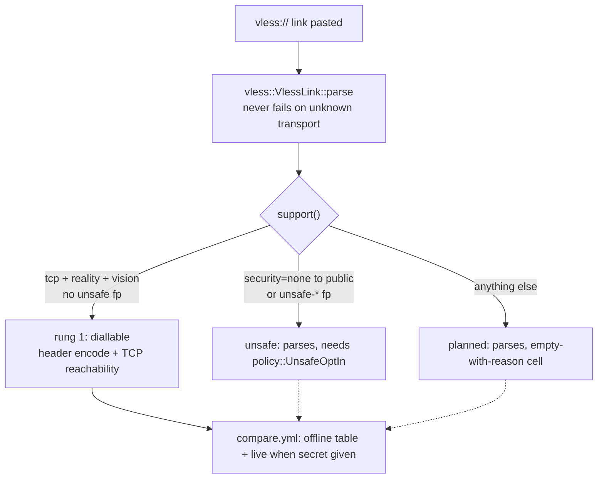

# The superset matrix: every way PattNG can connect, one rung at a time

Dovetail-core is a superset of Xray-core, sing-box, xray-rust and PattNG's Xray fork. That word is doing work: the matrix below is the set of transports the core *parses*, and exactly one of them *dials* so far. A row moves from "parses" to "dials" only with its differential proof and its benchmark gate — never with the parser alone.

## The order (do not reorder without the proof)

| # | transport | code status | proof |
| - | --------- | ----------- | ----- |
| 1 | VLESS TCP REALITY `xtls-rprx-vision` | `Implemented` — parse + `encode_into` + TCP reachability | differential header golden + identity gate + offline compare |
| 2 | VLESS TCP TLS (Vision optional) | `Planned` — parses, `support()` names the reason | TLS handshake differential vs Xray-core pin |
| 3 | VLESS TCP none (private) | `Planned` | framing differential |
| 4 | VLESS/TROJAN `security=none` to public (PattNG ext.) | `UnsafeRequiresOptIn` — parses, dials only with `UnsafeOptIn::allow_plaintext_to_public` | policy sign-off + isolated test net only |
| 5 | TROJAN TCP TLS | `Planned` — schema reserved | password framing differential |
| 6 | VMess TCP | `Planned` | AEAD differential first |
| 7 | Shadowsocks TCP/UDP | `Planned` | shares the record rung (`record::fill_exact`) |
| 8 | VLESS WS / XHTTP / gRPC / QUIC | `Planned`, one rung each | one transport per rung, never batched |
| 9 | WireGuard / MASQUE (H2+H3), Hysteria2, Aether | `Planned` | the ZeroNet WARP paths; after XHTTP |
| 10 | `cipherSuites` + `unsafe-*` fingerprints (PattNG ext.) | `UnsafeRequiresOptIn` — parsed, carried, never default | `policy::UnsafeOptIn::allow_unsafe_fingerprint` + ClientHello differential |

## What PattNG contributes (and where it lives in code)

- **`cipherSuites` and `unsafe-*` fingerprints in settings and share-links.** Preserved verbatim in `VlessLink::params`, reported by `VlessLink::fingerprint()` / `wants_unsafe_fingerprint()`. Enabling one is a `policy::UnsafeOptIn` value at the call site, never a default.
- **Plaintext VLESS/TROJAN to public addresses.** Upstream Xray-core refuses `security=none` off-loopback; PattNG's fork allows it. `transport::Security` splits `None` from `NoneToPublic` at parse time so the dial path cannot silently fall back to plaintext — the failure mode `tls/mod.rs` already refuses for TLS backends.
- **Aether core.** Listed as rung 9. No Aether source is vendored; when the rung lands, its suite runs from the PattNG pin in CI (see `docs/conformance.md`).

## What "superset" does not mean

It does not mean every row dials. It means every row *parses* and every comparison table shows every row — implemented cells with numbers, unimplemented cells empty *with the reason*. An omitted row reads as "not measured"; an empty-with-reason row reads as "measured, unsupported". The second is honest; the first is how a 0.83x survives to a release.
