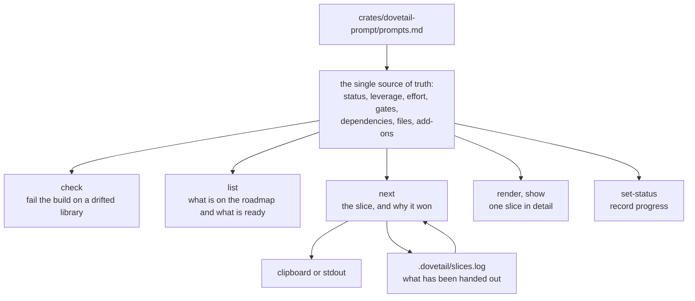
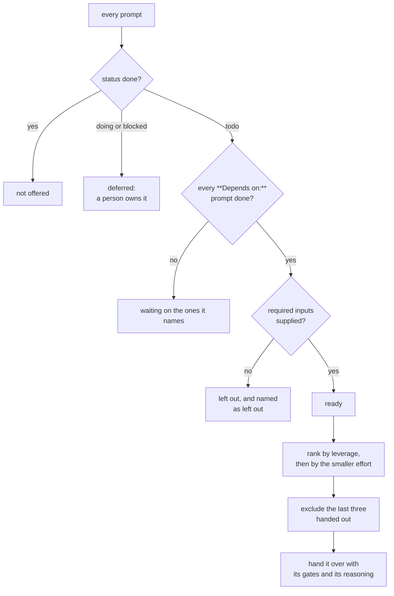
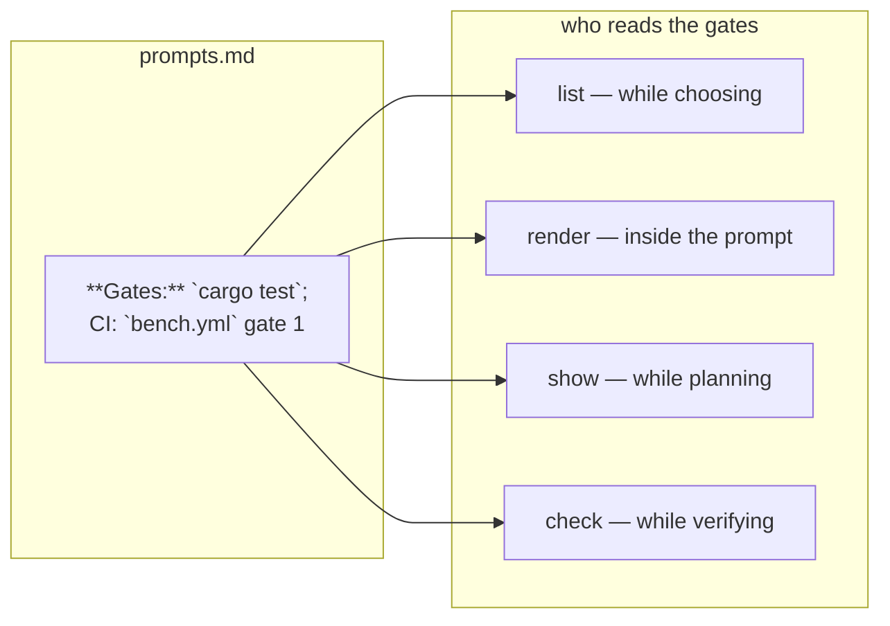

# `dovetail-prompt`

Renders the slice to work on next, from a Markdown library that is the only place prompt prose lives.

The rest of this repository is machinery for checking claims. This crate is the part that decides *what to check next*, so that "next" is a computed answer rather than whichever idea came to mind most recently.

## Why it exists

Every claim here is either checked by something that runs or it is not made. A claim with no check is a plan. The corollary, which took longer to notice, is that a *plan* with no defined shape cannot be checked either — "make it faster" has no acceptance criterion, so it stays open forever and the project stops moving on anything else.

So the roadmap is data, not prose: every slice carries a status, a leverage, an effort, the gates that would prove it finished, and the slices it blocks. Those fields are enough to answer "what now" without anybody's memory, and the answer comes with its reasoning attached, because a suggestion with no stated basis loses the argument to whoever has a better idea.



## How a slice is chosen



Three decisions in that diagram are worth defending.

**Leverage first, effort second.** Two slices of equal leverage are worth the same only if both get finished, and a small slice that finishes releases everything waiting on it while a large one that starts releases nothing. The tie then breaks on id, so two runs on two machines agree.

**A missing input is a decision, not a default.** `{key=default}` is a default; `{key}` is a judgement call, and the tool will not make it. A ready slice with an unfilled required input is left out of the ranking rather than rendered with a hole in it, and the ones left out are named in the output. This is the one place where the tool could have been convenient and chose not to be: a prompt with `{scope}` still in it reads as complete to whatever receives it, and the failure lands later than it should. `next` prints the command that would fill it instead, and `--allow-unfilled` is there for whoever wants to look anyway.

**Two slices claiming one file is a warning, not an error.** Only when both are *available* — started, or ready to start. Almost every slice in a roadmap this size touches `ci.yml` or the bench harness at some point, and a warning for every pair is a warning nobody reads.

## The gates travel with the prompt

`render` prints the slice's `**Gates:**` verbatim, from the same Markdown the contributor reads in `list`. "What does done mean" is therefore one string, not two: a terminal, a commit message and an agent all see the same checks, and the library is where they are edited.



## The ledger

Every handout is appended to `.dovetail/slices.log`, and the next few calls leave those slices out. Without it, "pick something for me" returns the same answer every time, which makes the picking worth exactly as much as the reader's memory of it.

The ledger is one line per handout — timestamp, prompt, how it was asked for — and it is not in version control: whose slices have been handed out is a fact about one contributor on one machine, and committing it would make every other contributor's suppression window wrong.

Rotation draws from the *ready* set only, weighted by `**Random weight:**`. The tool this replaces drew from every prompt in the library, so a zero-weight prompt could still be drawn and the weight controlled nothing.

## Provenance

A rendered prompt can end with a comment naming the slice, the file it came from and a tag over the exact library text:

```
<!-- dovetail-prompt · P2 · crates/dovetail-prompt/prompts.md · library tag bd5be2b6c9d4fafa (fnv1a-64, not a checksum) -->
```

The tag is FNV-1a and it says so. It is not a checksum and nothing about correctness depends on it; it exists so an answer can be traced back to the text that asked the question, and a tag with a collision-prone hash is enough for that.

That footer and the `# P<n> · <title>` header are both off by default (`Options::provenance` turns them on together): what gets pasted is the request, and both ends of it describe the tool rather than the work. The tag is still reported by `--json` on every verb, where a machine is the one reading it.

## What it refuses to do

- It will not invent a value for a placeholder that has none.
- It will not pick a slice whose inputs are unfilled.
- It will not render from a library with a malformed section, because a prompt with a hole in it looks exactly like a prompt that is ready.
- It will not read the prose in a body. It has an opinion about whether a prompt could be rendered, not about what it should say.

## Verification

| property | how it is checked |
| --- | --- |
| the live library parses | `markdown::tests::the_live_library_has_no_errors`, `contract::the_live_library_parses_without_a_single_error` |
| the live library is coherent | `contract::the_live_library_passes_its_own_gate`, and `cargo run -p dovetail-prompt -- check` in `ci.yml` |
| every prompt renders, twice, identically | `contract::every_prompt_renders_end_to_end_and_renders_the_same_twice` |
| every add-on resolves and renders | `contract::every_add_on_resolves_and_renders` |
| the gates reach the prompt | the same test, gate by gate |
| the ranking is justified and reproducible | `advisor::tests`, `contract::the_advisor_always_has_a_justified_answer` |
| a cycle is named, not hung on | `markdown::tests::a_cycle_is_reported_with_the_prompts_in_it` |
| the ledger survives a bad line | `advisor::tests::a_corrupt_ledger_line_is_counted_not_obeyed` |
| a status rewrite touches one line | `main::tests::set_status_rewrites_one_line_and_nothing_else` |

## Exit codes

| code | when |
| --- | --- |
| `0` | something was handed over |
| `1` | the library has errors, `check` found one, or there was no slice to hand over |
| `2` | bad flag, unknown prompt, missing input value, unreadable library |

A script can tell them apart: `1` is a state of the repository that editing the library clears, and `2` is a mistake at the keyboard that no amount of editing Markdown will.

## Commands

```bash
dovetail-prompt next                       # the slice, the reason, copied
dovetail-prompt next --rotate --seed 4     # a different one, reproducibly
dovetail-prompt list --status todo         # the roadmap, filtered
dovetail-prompt render 5 --addon isa-matrix # one slice's prompt
    dovetail-prompt show 5                     # its dependencies and history
    dovetail-prompt set-status 5 doing        # record progress, no hand-edit
    dovetail-prompt check                      # the gate ci.yml runs
dovetail-prompt next --json                # the same answer, for an agent
```