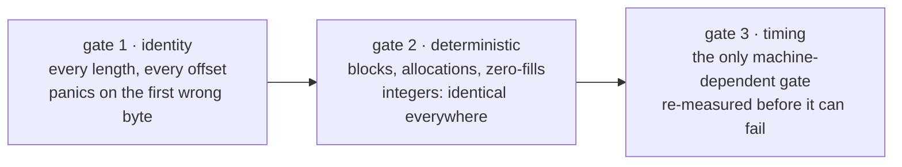

# Methodology

How to read a number in this repository, and what it does not entitle you to.

## The order of the gates

1. **Identity runs first.** Every length and every block offset is compared byte for byte against the pinned reference. A wrong core never gets to be a fast one, because this fails first.
2. **Then the deterministic properties.** Blocks generated, heap allocations and zero-fills are integer counts: identical on every machine, so they are gated outright rather than reported and compared by eye.
3. **Then timing.** A duration is a distribution, not a fact.

The report is written to disk **before** the gate is asserted on, so a failing run still publishes the table it failed on. Asserting first meant a red build printed "no report", which is the one moment the numbers are wanted.

## One regressing length fails the job

The timing gate fails if the implementation is more than 5% slower at **any single timed length**: the bar is 0.95x, and a confirmed slower length is a regression, not noise. Robustness comes from the measurement rather than from a lenient bar alone — best of 5 interleaved rounds per side (the five-run discipline behind every published comparator chart), so one scheduling hiccup does not become a permanent entry in the table. A length that comes out under the bar is then **re-measured at four times the budget** before it is allowed to fail: the re-measure confirms the number, it does not lower the bar. Those rows are marked `remeasured` in the table.

## What "faster" is allowed to mean

| statement | acceptable | not acceptable |
| --- | --- | --- |
| about this repo's CI | "1.05x at 2 KiB on linux x86_64, run 2026-10-02" | "fastest" |
| about a length | "no worse than 0.95x of the reference at any measured length from 65 bytes up; lengths 1–64 are a tie by construction and identity-checked only" | "faster in general" |
| about a device | "on the four architectures CI runs" | "on any device" |
| about correctness | "byte-identical to the pinned reference" | "compatible" |

A benchmark is a measurement of a configuration at a point in time. It decays: a new CPU, a new upstream release, a changed input distribution. `bench.yml` runs weekly for that reason, so the claim is never older than the last measurement.

## Read both ends of every ratio

The report's header names the reference the run declared **and** the backend that reference actually compiled to, next to the core this build ran. This matters more than it sounds: `chacha` 0.9.1 falls back to a scalar core on aarch64 because its NEON backend is gated behind a cfg nothing sets, so on that architecture most of any speedup is the reference not using its SIMD path.

A ratio quoted without both names is not a measurement of this workspace.

## Comparing apples to oranges in the timing gate

The reference is re-keyed and re-seeked on **every call** — `ChaCha20::new` plus `seek` — which a stateful record layer would not do. That is a fixed cost the reference pays and this implementation does not, and it flatters short lengths in particular. The 16384-byte row is the one closest to a real VMess or Shadowsocks record and should be read as the headline; the short-length rows are the `fill_exact` advantage, not a proxy throughput number.

The allocation counts, by contrast, are exact. They are taken with the harness's buffer allocated *before* the counting window opens, so the harness's own `vec!` never lands inside a count. Gate 2 covers the record layer at every length and every block offset — six offsets, the same ones gate 1 sweeps — and the rung-1 header encode across all three address families — both are gated at exactly 0, because one allocation per record or per dial is one per connection forever. `scripts/check-leak-surface.sh` is the static half of the same claim: no DNS resolution, no lifetime-laundering primitives, no printing and no wall-clock reads inside `dovetail-core`, where each would be a leak around the proxy, a hidden allocation, or a timing side channel.

## Upstream comparison

Upstream implementations are pinned by commit in [`../upstream/pins.toml`](../upstream/pins.toml), not tracked. A comparison against "latest" is not a comparison — the report has to name what it was measured against.

`scripts/check-upstream-pins.sh` fails if a pin stops resolving, if a source has **no** `rev` at all, or if the file parses to nothing. An unpinned source is a hard error rather than a skip: a pin check that tolerates the entries it exists to enforce reads as coverage while providing none. Each `rev` is verified by a depth-1 fetch of that exact object, not by `ls-remote`, because `ls-remote` only lists what refs point at — a force-pushed branch whose old commit is now unreachable would still "resolve" by name.

`scripts/update-pins.sh` refreshes the pins, prints the diff, and opens a PR rather than pushing. A pin bump changes what every comparison is measured against, so it is reviewable on its own.

Upstream test suites are **run against** Dovetail's binaries in CI, not copied into this repository: sing-box is GPL-3.0 and Xray-core is MPL-2.0, and copying their tests here would make this work's licence undecidable. Running their suites unmodified is both licence-clean and a stronger claim than a hand-rewritten vector. When a rung is implemented, every suite covering it checks the implementation — the suite flips in `upstream/pins.toml`, never here. That running is currently 1 of 7 against Dovetail binaries, checked by `conformance.yml` via `scripts/run-upstream-suite.sh` (`zeronet`, whose whole `xray_oracle` command runs and 2 of its 17 tests pass; six skips with reasons). The suite command is never narrowed to the tests that happen to pass: `gate_tests` names the passing subset, every other verdict is printed, and a test that passes without the gate naming it fails the job, per `docs/conformance.md`.

Every benchmark report ends with the per-method matrix (`crates/dovetail-bench/src/methods.rs`), generated the way ZeroNet generates its support table from its capability data: status cells are read from the parser at report time for every row the link format can express, so the table cannot drift away from what the core actually accepts. An unimplemented cell stays empty with its reason and its proof, never omitted.

## Adding a SIMD backend

The condition is bit-identity, not speed. A backend is merged only after:

1. it implements `Lanes` and nothing else — no round function of its own;
2. it matches `chacha::portable` byte for byte at every length and every block offset, including both sides of every group boundary;
3. the keys used differ in every byte (see [`function/record-fill-exact.md`](../function/record-fill-exact.md) for why);
4. it is measured on one native runner per ISA, not one machine;
5. every `unsafe` block carries a `SAFETY:` comment — enforced by `clippy::undocumented_unsafe_blocks`, denied workspace-wide.

A backend that cannot be interpreted by Miri must be argued for instead: what it assumes, and which check discharges each assumption.

Widths chosen on one core and not measured on another are widths chosen on one machine.